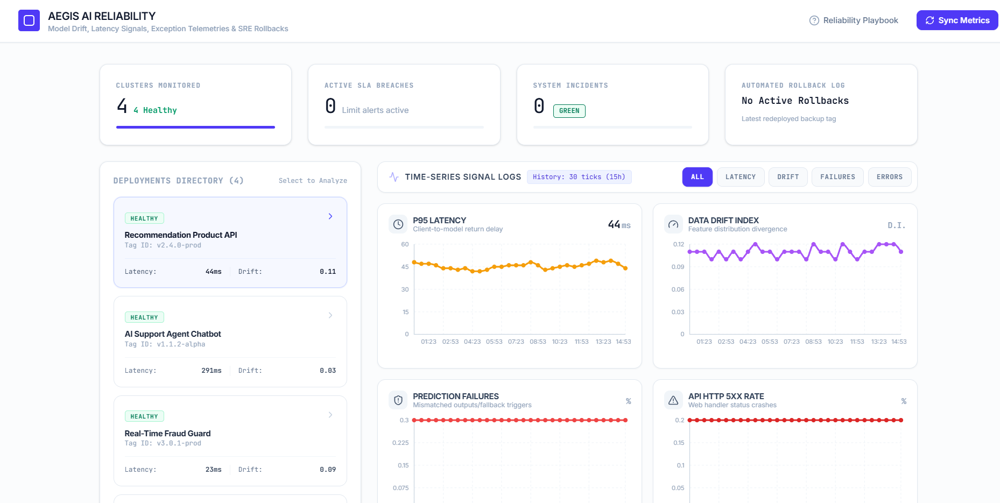
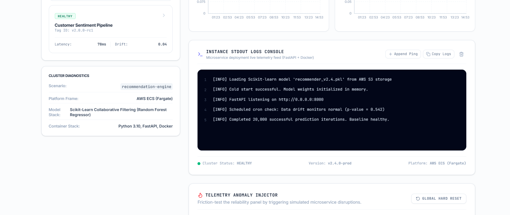
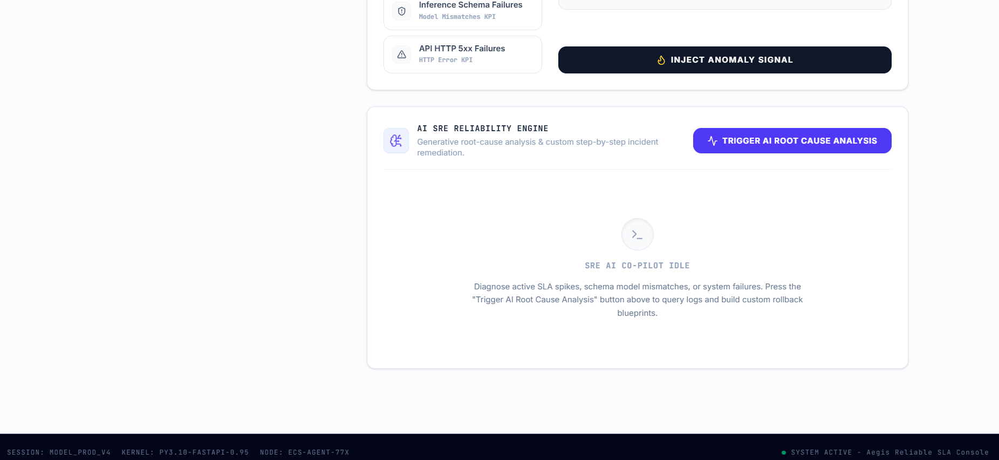
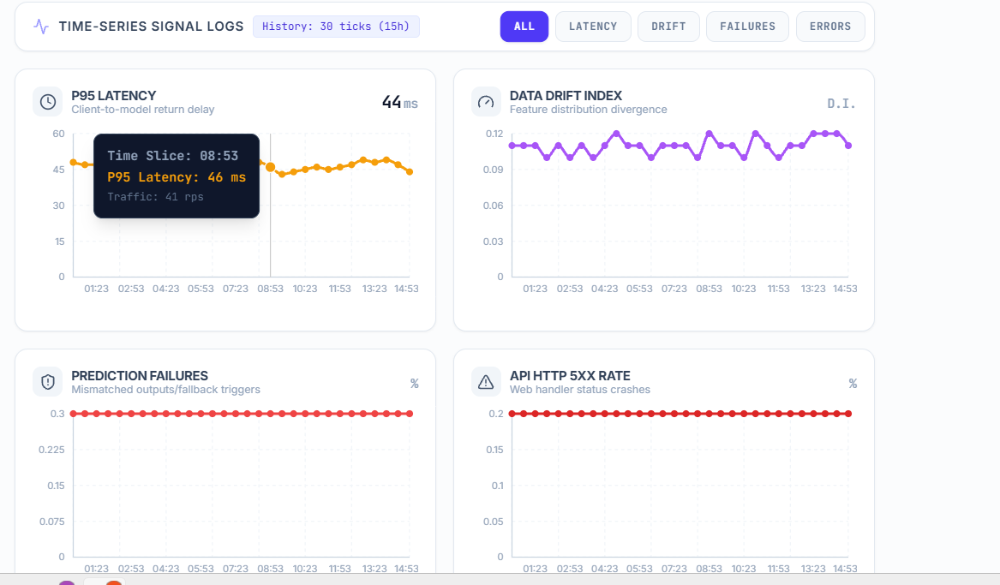
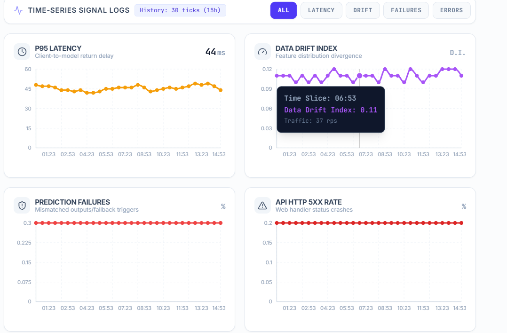
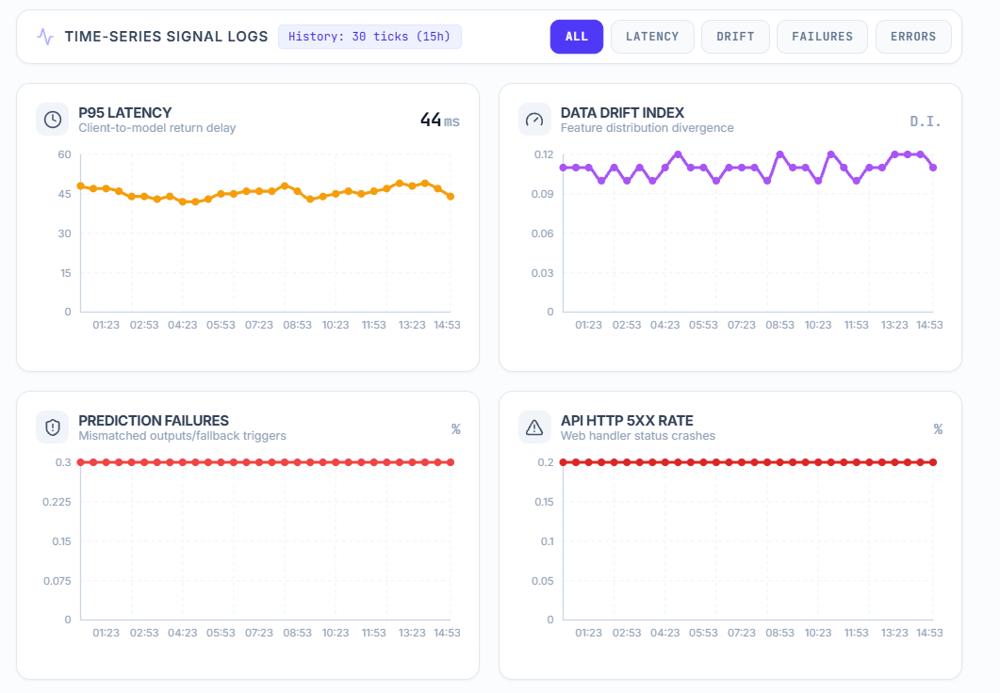
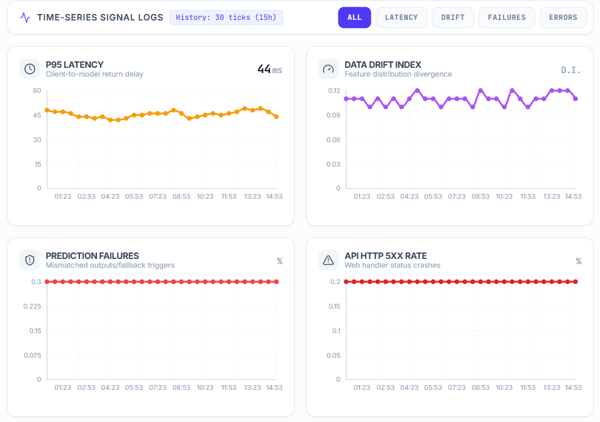

# AEGIS: Production AI Monitoring & Reliability Platform

Production-grade AI monitoring and reliability platform for tracking model drift, latency spikes, prediction failures, API failures, and automated SRE-style incident remediation across simulated ML deployments.

---

## Overview

AEGIS is an AI production monitoring and reliability platform designed to simulate real-world MLOps observability for deployed machine learning systems.

The platform continuously monitors inference health, model drift, latency fluctuations, prediction anomalies, API degradation, and system reliability metrics across multiple deployment environments.

It includes AI-assisted incident diagnostics, telemetry-based anomaly injection, root cause analysis, rollback recommendations, and deployment-level monitoring inspired by enterprise-grade SRE workflows.

---

## Key Features

- Real-time monitoring for deployed AI systems
- P95 latency tracking and inference performance analysis
- Data drift monitoring for feature-distribution changes
- Prediction failure detection and schema mismatch analysis
- API HTTP 5XX error monitoring
- AI-powered root cause analysis engine
- Reliability scoring across deployment pipelines
- Incident simulation and anomaly injection
- Cluster-level deployment telemetry
- Automated rollback recommendations
- Multi-service deployment monitoring
- Production-style observability dashboard

---

## Core Monitoring Metrics

### Latency Monitoring
Tracks model inference latency in real time using percentile-based monitoring.

- P95 latency monitoring
- Response-time degradation detection
- Latency spike visualization
- Time-series telemetry tracking

---

### Model Drift Detection
Continuously analyzes feature distribution shifts to detect performance degradation before model failure.

- Drift score tracking
- Distribution divergence analysis
- Temporal monitoring
- Real-time anomaly surfacing

---

### Prediction Failure Monitoring
Detects:

- Schema mismatches
- Invalid outputs
- Failed prediction pipelines
- Feature incompatibility issues
- Inference instability

---

### API Reliability Monitoring
Tracks:

- HTTP 5XX failures
- API instability
- Request failure rates
- Backend reliability degradation
- Service outages

---

## AI SRE Reliability Engine

AEGIS includes an AI-assisted Site Reliability Engineering engine that performs:

- Automated incident diagnostics
- Root cause analysis
- Service failure investigation
- Reliability scoring
- Rollback suggestions
- Production incident summaries

---

## Cluster Telemetry & Deployment Monitoring

Production-style monitoring console for deployed ML systems.

Capabilities include:

- Container telemetry monitoring
- Deployment health tracking
- Model version diagnostics
- Runtime log monitoring
- Infrastructure status visibility
- AWS deployment simulation

---

## Telemetry Anomaly Injection

Simulate real-world infrastructure failures and production anomalies to test resilience.

Examples:

- Latency spikes
- Data drift scenarios
- API failures
- Prediction schema mismatches
- Inference degradation
- Service instability

---

## Reliability Monitoring Dashboard

The platform provides centralized observability for multiple ML deployments with health indicators, SLA breach tracking, and rollback monitoring.

---

## Technology Stack

**Backend**
- Python
- FastAPI

**Machine Learning**
- Scikit-learn
- Drift Detection Logic
- Statistical Monitoring

**Cloud & Infrastructure**
- Docker
- AWS Simulation

**Monitoring**
- Time-Series Metrics
- Telemetry Pipelines
- Incident Monitoring
- SRE Reliability Systems

---

## Production Use Cases

### AI/ML Production Monitoring
Monitor deployed ML systems for reliability and model health.

### MLOps Observability
Track model quality, drift, latency, and inference performance.

### Incident Response Simulation
Train AI systems to detect and analyze failures automatically.

### Reliability Engineering
Reduce downtime through automated diagnostics and rollback planning.

### Enterprise AI Operations
Provide centralized monitoring for multiple deployed models.

---

## Performance Highlights

- Simulates enterprise-grade AI reliability workflows
- Tracks multiple production reliability KPIs
- Detects drift and inference degradation in real time
- Supports SRE-style incident diagnostics
- Centralized deployment monitoring system
- Automated reliability analysis and rollback recommendations

---

## Screenshots

### Platform Dashboard

### Monitoring Metrics

### Drift Analysis

### Root Cause Engine

### Cluster Console

### Reliability Monitoring

---

## Future Enhancements

- Kubernetes deployment monitoring
- Prometheus + Grafana integration
- Real-time alert pipelines
- Slack/Email incident notifications
- LLM-powered remediation workflows
- Multi-region observability support

---

## Author

**Sankeerthana Verneni**

AI/ML • MLOps • Reliability Engineering • Backend Systems
